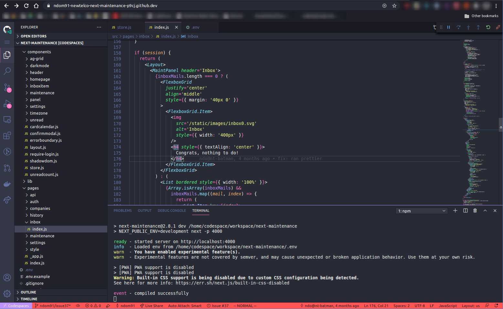
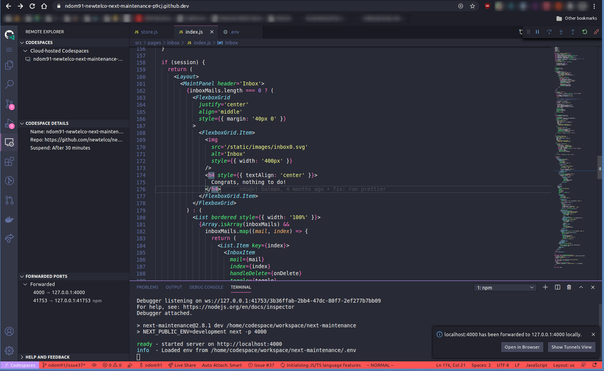
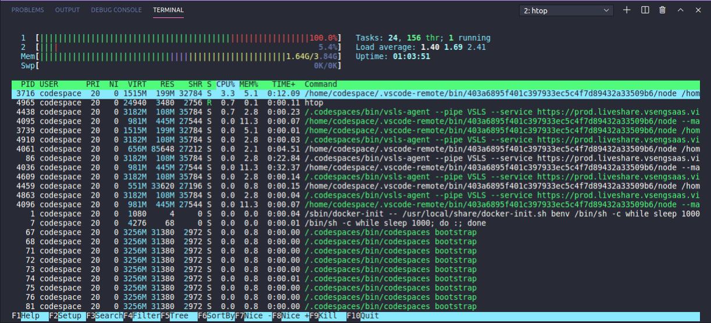
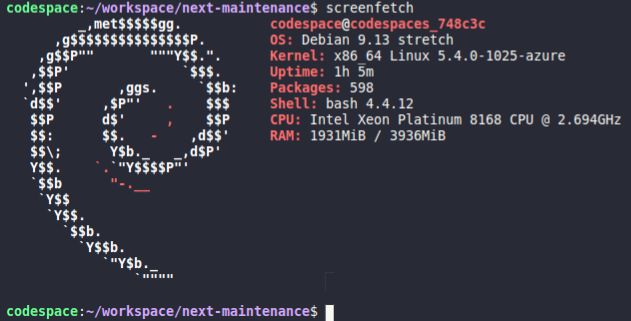

Github announced their new web based development environment called _Codespaces_ at their Satelitte 2020 Event. To be honest, this was the feature I was most excited about this year. And this evening, I finally got the email that I have access to the beta version of it!

First things first, I had some trouble finding out how to launch a codespace for a given repo. I navigated around the repo README page a bit, and eventually found the option under the green "Code" button, where you can open the collapsible menu that contains the clone URL. There is now also an option to open the repo in a new codespace / a list of any existing codespaces for that repository.

So once I fired up my first codespace, and after approximately 45 seconds - 1 minute to fire up the container - I was greeted with the all too familiar VS Code layout when you open a new project. They initially launched with a terminal open and a way too bright Github Theme. The first thing I did was install a Dracula Theme and the Vim Extension.



To my surprise the extensions installed without a hitch, and "reloading" VS Code then only took as long as you'd expect a normal Github page reload to take and then the theme was applied! I continued by doing what I'd do in any development environment, installed the project's dependencies and fired up the dev server. This is where I noticed the first significant difference.



As soon as the development server was started, VS Code popped up a notification telling me the local development port had been forwarded locally. The action buttons were "Open in Browser" and "Show Tunnels View". Open in browser simply opened the dev environment in a new tab under a url like: `[uuid].apps.codespaces.githubusercontent.com`. The next option, show tunnels view, was also something new to me. This opened a new sidebar in VS Code which gave an overview of the current container it was running in - which repo was opened, which ports were forwarded, and a line item which said "Suspend: After 30 Minutes". I assume that's the default time-out. After 30 minutes of inaction it will most likely tear down that container.

After making some minor changes to my code and feeling very at-home in this "new" VS Code environment, I decided to go digging a bit into what else I could see from inside this container. 

I realized `apt` was installed, so it had to be based on a debian-based distro, and installed a few applications. `vim` was already installed by default, by the way!



`htop` ran without a hitch and reported some interesting stuff. Looks like the container was given access to 2 cores and 4gb of RAM, and there was an odd process running:

```
/bin/sh -c while sleep 1000; do:; done
```

What could possibly be the point of this? As far as I can understand, this just loops every 1000 ms and does nothing, and then does nothing again 1000 ms later. What?

Anyway, what linux based post would be complete without a `screenfetch` screenshot!



Looks like its running Debian 9 Stretch and a relatively recent kernel (5.4), which is good to see.

So in summary, without having spent a great deal of time with codespaces - I can already say that I am a big fan and can definitely see the use-case for something like this. Kernel developers could work from a dinky chromebook in an airport and not have to worry about having a beefy machine to run builds on, etc. Web Devs have an easy common environment for their entire team to run and public development URLs you can share with colleagues or clients! Everything around VS Code feels just like on the desktop, because well it is just VS Code. But you get what I mean, its snappy, all the extensions I tested work, it feels great. 

Personally, I don't know if I'll be using it a ton because I don't have a direct use for it at the moment, but I definitely am a big fan and wish the team at Github the best of luck with this!


